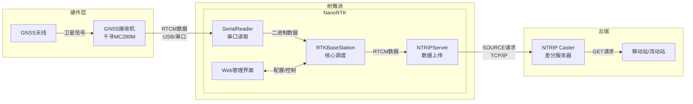
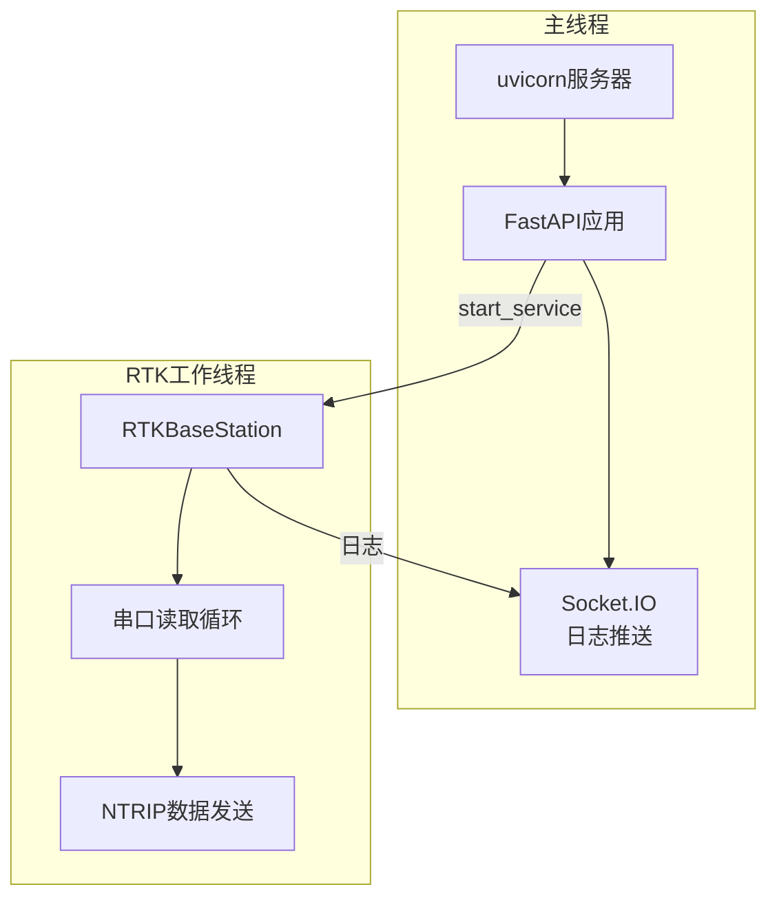
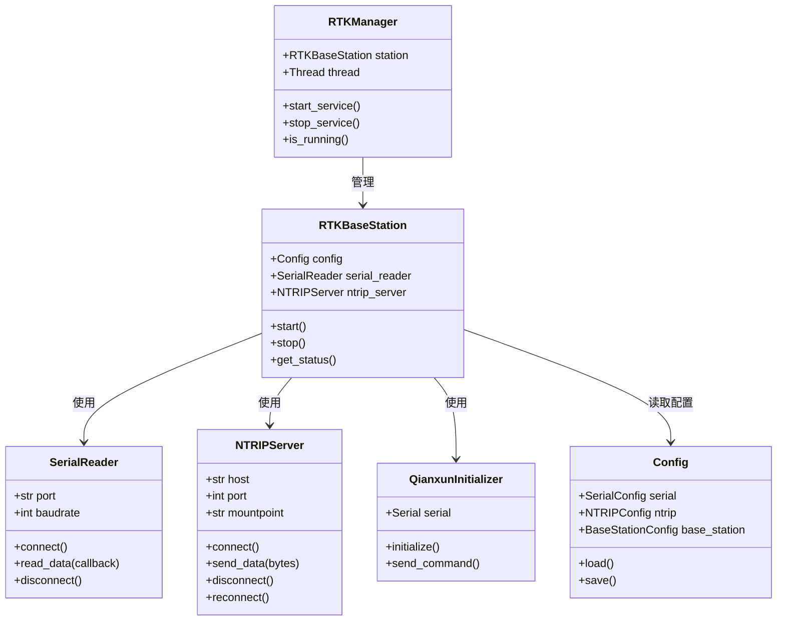
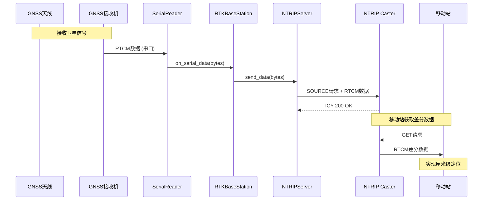
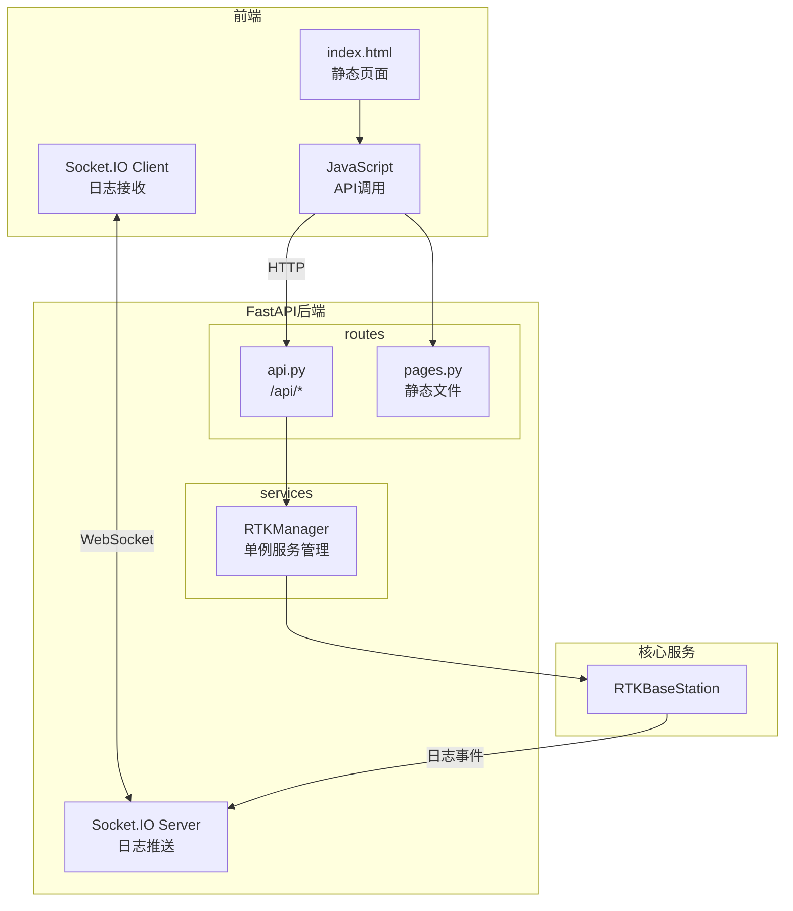

# NanoRTK

<p align="center">
  <strong>轻量级 RTK 基站软件 - 专为树莓派设计</strong>
</p>

<p align="center">
  
  
  
  
</p>

---

## 📖 项目简介

NanoRTK 是一款专为树莓派设计的轻量级 RTK（实时动态定位）基站软件。它能够将 GNSS 接收机（如千寻 MC280M）的 RTCM 差分数据实时上传到 NTRIP Caster 服务器，为移动站提供厘米级定位服务。

### 🎯 核心功能

- **RTCM 数据转发**：从串口读取 GNSS 接收机的 RTCM3.2 数据，实时转发到 NTRIP Caster
- **接收机自动配置**：自动初始化千寻 MC280M 接收机，配置基站坐标和 RTCM 输出
- **Web 管理界面**：基于 FastAPI 的现代化 Web 控制台，支持实时日志推送
- **自动重连机制**：网络断开时自动重连，保证服务稳定性
- **系统监控**：实时显示 CPU 温度、内存使用等系统状态

### 🏗️ 应用场景

- **自建 RTK 基站**：在已知坐标点部署 RTK 基站，提供差分服务
- **测绘作业**：为无人机、测量仪器等提供厘米级定位支持
- **农业自动驾驶**：为农业机械提供精准导航服务
- **物联网定位**：为需要高精度定位的 IoT 设备提供支持

---

## 🛠️ 技术栈

| 组件 | 技术选型 | 说明 |
|------|---------|------|
| **后端框架** | FastAPI | 高性能异步 Web 框架 |
| **实时通信** | Socket.IO | WebSocket 封装，支持实时日志推送 |
| **配置管理** | Pydantic + YAML | 类型安全的配置验证 |
| **串口通信** | PySerial | 与 GNSS 接收机通信 |
| **系统监控** | psutil | 获取 CPU、内存等系统信息 |
| **前端框架** | Bootstrap 5 | 响应式 UI 设计 |
| **地图组件** | Leaflet | 交互式地图，支持坐标选取 |

---

## 📁 项目结构

```
nanorkt/
├── app/                        # 主程序包
│   ├── core/                   # 核心业务逻辑
│   │   ├── config.py           # 配置管理（Pydantic）
│   │   ├── exceptions.py       # 自定义异常
│   │   ├── logging_config.py   # 统一日志配置
│   │   └── station.py          # RTK 基站主类
│   ├── drivers/                # 硬件驱动
│   │   ├── serial_reader.py    # 串口读取器
│   │   ├── ntrip_server.py     # NTRIP Server（基站向 Caster 推送）
│   │   └── qianxun.py          # 千寻接收机驱动
│   └── web/                    # Web 应用
│       ├── app.py              # FastAPI 应用
│       ├── utils.py            # 工具函数
│       ├── routes/             # 路由模块
│       │   ├── api.py          # REST API
│       │   └── pages.py        # 页面路由
│       └── services/           # 服务层
│           └── rtk_manager.py  # RTK 服务管理器
├── static/                     # 静态资源
│   ├── index.html              # Web 控制台页面
│   ├── css/                    # CSS 样式
│   ├── js/                     # JavaScript
│   └── ...
├── config.yaml                 # 配置文件
├── requirements.txt            # Python 依赖
├── install.sh                  # 一键安装脚本
└── README.md                   # 本文档
```

---

## 🚀 快速开始

### 环境要求

- **硬件**：树莓派 3B+/4B（推荐 4B）
- **系统**：Raspberry Pi OS（64-bit 推荐）
- **Python**：3.9 或更高版本
- **GNSS 接收机**：千寻 MC280M 或兼容设备

### 一键安装

```bash
# 克隆项目
git clone https://github.com/weefnn/nanorkt.git
cd nanorkt

# 运行安装脚本
./install.sh              # 仅安装依赖
sudo ./install.sh         # 安装依赖并注册系统服务
```

### 手动安装

```bash
# 1. 创建虚拟环境
python3 -m venv .venv
source .venv/bin/activate

# 2. 安装依赖
pip install -r requirements.txt

# 3. 编辑配置文件
nano config.yaml

# 4. 启动服务
python run_web.py
```

### 配置说明

编辑 `config.yaml` 文件：

```yaml
# 串口配置
serial:
  port: /dev/ttyUSB0    # 串口设备路径
  baudrate: 115200       # 波特率

# NTRIP Caster 配置
ntrip:
  host: your-ntrip-server.com
  port: 2101
  mountpoint: YOUR_MOUNTPOINT
  username: your_username
  password: your_password

# 基站坐标配置
base_station:
  latitude: 39.9042      # 纬度（度）
  longitude: 116.4074    # 经度（度）
  altitude: 50.0         # 海拔高度（米）
  enable_arp_average: 0  # 0=固定坐标, 1=ARP平均模式

# 重连配置
reconnect:
  max_retries: 5         # 最大重试次数
  retry_delay: 5.0       # 重试间隔（秒）
```

访问 `http://树莓派IP:8000` 打开 Web 控制台。

---

## 🖥️ Web 管理界面

Web 管理界面提供以下功能：

### 配置管理
- 串口参数配置（端口、波特率）
- NTRIP Caster 连接配置
- 基站坐标设置（支持地图选点）
- 重连策略配置

### 服务控制
- 一键启动/停止 RTK 服务
- 实时查看服务运行状态

### 系统监控
- CPU 温度监控（树莓派）
- 内存使用情况
- 系统运行时间
- 硬件信息显示

### 实时日志
- WebSocket 实时日志推送
- 日志级别颜色区分
- 一键清空日志

---

## 🔧 部署到树莓派

### 方式一：一键安装（推荐）

```bash
# 安装依赖并注册系统服务
sudo ./install.sh

# 管理服务
sudo systemctl start nanorkt    # 启动
sudo systemctl stop nanorkt     # 停止
sudo systemctl restart nanorkt  # 重启
sudo systemctl status nanorkt   # 查看状态
sudo systemctl enable nanorkt   # 开机自启

# 查看日志
journalctl -u nanorkt -f
```

### 方式二：手动运行

```bash
# 激活虚拟环境
source .venv/bin/activate

# 启动服务
python run_web.py
```

### 串口权限配置

树莓派上访问串口需要权限：

```bash
# 将当前用户添加到 dialout 组
sudo usermod -a -G dialout $USER

# 重新登录后生效
```

---

## 🏛️ 架构设计

### 整体架构

NanoRTK 采用分层架构设计，将系统分为三个主要层次：

```
┌─────────────────────────────────────────────────────────────┐
│                      Web 层 (app/web)                       │
│  ┌─────────────┐  ┌─────────────┐  ┌─────────────────────┐ │
│  │   routes/   │  │  services/  │  │       app.py        │ │
│  │  api.py     │  │ rtk_manager │  │  FastAPI + SocketIO │ │
│  │  pages.py   │  └─────────────┘  └─────────────────────┘ │
│  └─────────────┘                                            │
└─────────────────────────────────────────────────────────────┘
                              │
                              ▼
┌─────────────────────────────────────────────────────────────┐
│                     核心层 (app/core)                        │
│  ┌─────────────┐  ┌─────────────┐  ┌─────────────────────┐ │
│  │   config    │  │   station   │  │     exceptions      │ │
│  │  Pydantic   │  │ RTKBaseStation│ │   自定义异常体系    │ │
│  └─────────────┘  └─────────────┘  └─────────────────────┘ │
└─────────────────────────────────────────────────────────────┘
                              │
                              ▼
┌─────────────────────────────────────────────────────────────┐
│                    驱动层 (app/drivers)                      │
│  ┌─────────────┐  ┌─────────────┐  ┌─────────────────────┐ │
│  │ SerialReader│  │ NTRIPServer │  │ QianxunInitializer  │ │
│  │  串口读取   │  │  数据上传   │  │    接收机初始化     │ │
│  └─────────────┘  └─────────────┘  └─────────────────────┘ │
└─────────────────────────────────────────────────────────────┘
```

### 数据流向图



### 线程模型



### 模块依赖关系



### NTRIP 数据流



### Web 服务架构



---

## ⚡ 工程特色

### 1. 模块化架构
采用分层设计，将核心逻辑、硬件驱动和 Web 应用分离：
- **core**：纯业务逻辑，不依赖 Web 框架
- **drivers**：硬件抽象层，易于扩展新设备
- **web**：独立的 Web 服务，可选部署

### 2. 纯静态前端
- Web 界面为纯静态 HTML/CSS/JS
- 配置通过 REST API 动态加载
- 无需模板引擎，部署更简单

### 3. 类型安全
全面使用 Python 类型注解和 Pydantic 模型：
- 配置文件自动验证
- IDE 智能提示支持
- 运行时类型检查

### 4. 自定义异常体系
层次化的异常设计，便于精确错误处理：
```python
NanoRTKError          # 基础异常
├── SerialConnectionError    # 串口异常
├── NTRIPConnectionError     # NTRIP 异常
├── ConfigurationError       # 配置异常
└── ReceiverInitError        # 接收机异常
```

### 5. 统一日志管理
集中式日志配置，支持多种输出方式：
- 控制台输出
- 文件存储（自动轮转）
- WebSocket 实时推送

---

## 🔍 解决的问题

| 问题 | 解决方案 |
|------|---------|
| NTRIP 连接不稳定 | 自动重连机制，可配置重试次数和间隔 |
| 接收机配置复杂 | 自动发送初始化命令序列 |
| 远程管理困难 | Web 界面远程配置和监控 |
| 服务异常中断 | systemd 服务管理 + 看门狗 |
| 调试信息查看 | 实时日志 WebSocket 推送 |
| 配置类型错误 | Pydantic 自动验证和类型转换 |

---

## 📋 API 接口

### 获取串口列表
```
GET /api/serial-ports
```

### 获取系统状态
```
GET /api/system
```

### 获取/更新配置
```
GET /api/config
POST /api/config
```

### 服务控制
```
POST /api/control
Body: {"action": "start"} 或 {"action": "stop"}
```

---

## 🤝 贡献指南

欢迎提交 Issue 和 Pull Request！

1. Fork 本仓库
2. 创建特性分支 (`git checkout -b feature/amazing-feature`)
3. 提交更改 (`git commit -m 'Add amazing feature'`)
4. 推送到分支 (`git push origin feature/amazing-feature`)
5. 创建 Pull Request

---

## 📄 许可证

本项目采用 MIT 许可证 - 详见 [LICENSE](LICENSE) 文件

---

## 📮 联系方式

如有问题或建议，请提交 Issue 或联系项目维护者。

---

<p align="center">
  Made with ❤️ for RTK enthusiasts
</p>
